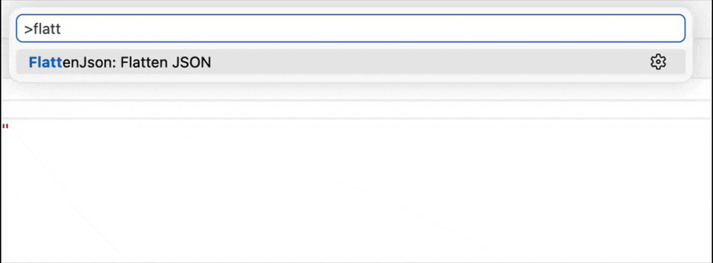

# FlattenJson

Flatten nested JSON into the flat, delimited keys config systems expect — colon for .NET's `secrets.json`/`IConfiguration`, `__` for Docker/Kubernetes/ASP.NET Core environment-variable overrides — instead of rewriting nested blocks by hand.



## Example

Input — paste just the properties, no surrounding `{ }` required:

```json
// { surrounding braces are optional — making it easier to translate a subsection of your json
"ConnectionStrings": {
  "Default": "Server=.;Database=MyApp;"
},
"ApiKeys": {
  "Stripe": "sk_test_123",
  "SendGrid": "SG.abc123"
},
"AllowedHosts": ["localhost", [], "example.com"],  // empty containers (like this array) are skipped entirely
"Retries": 3,      // numbers, booleans, and null are preserved as-is, not stringified
"Debug": false,
"Timeout": null
// } Output is always a valid json with surrounding {} braces. 
```

Output — flattened with the default `:` separator (pick another via the separator picker):

```diff
{
  "ConnectionStrings:Default": "Server=.;Database=MyApp;",
  "ApiKeys:Stripe": "sk_test_123",
  "ApiKeys:SendGrid": "SG.abc123",
  "AllowedHosts:0": "localhost",
- "AllowedHosts:1"                  // never produced — the empty array contributes no key, so this index is skipped
  "AllowedHosts:2": "example.com",
  "Retries": 3,
  "Debug": false,
  "Timeout": null
}
```

## Usage

1. Open the Command Palette (`Cmd+Shift+P` / `Ctrl+Shift+P`).
2. Run **Flatten JSON**.
3. Choose a source: **Active Document**, **Active Selection**, **Clipboard**, or **Pick a File...**.
4. Choose a separator: **:**, **.**, **__**, **/**, **_**, or **-**. Your last pick is offered first.
5. The flattened result opens in a new unsaved JSON tab — copy it wherever you need it.

## Requirements

None — works out of the box.

## Extension Settings

This extension does not contribute any settings.

## Release Notes

See [CHANGELOG.md](CHANGELOG.md) for release notes.

---

## Development

- `pnpm install` — install dependencies
- `pnpm run watch` — build in watch mode
- `pnpm test` — run the test suite

See `CLAUDE.md` for architecture notes.
